# TP-Link Setup

Diese Anleitung soll helfen den TP-Link in eine ordentliche Konfiguration zu bringen.


## Vorgehen

* reset router
* login at 192.168.0.1
* quick setup
  * access mode
  * name change and wlan password
* change hostname
* change router ip address to 192.168.x.254
* change WLAN ip Range 192.168.x.1-199
* set wlan timeout to 600
* firewall disable
* change admin password

# Reset des Routers

**Mit einem frischen Router ist das nicht nötig und ihr könnt zum nächsten Schritt springen.**

Als erstes müsst ihr den Router per Hardware Reset zurücksetzen, wenn er schon vorher eine andere Konfiguration hat.

Das passiert dadurch in dem ihr wenn der Router angeschlossen ist in die das kleine Loch rein drückt und *ca 10 sekunden* wartet nach den 10 sekunden oder während dessen solltet die LED des Routers anfangen zu blinken.

Anschleißend ist er wieder auf Werkseinstellungen und ihr könnt mit dem nächsten Schritt beginnen.

# Anmelden im Router
Der Router hat die IP `192.168.0.1` , wenn er in Werks Modus ist. Um sich anzumelden nimmt man folgenden Zugangsdaten
```
Account: admin
Passwort: admin
```
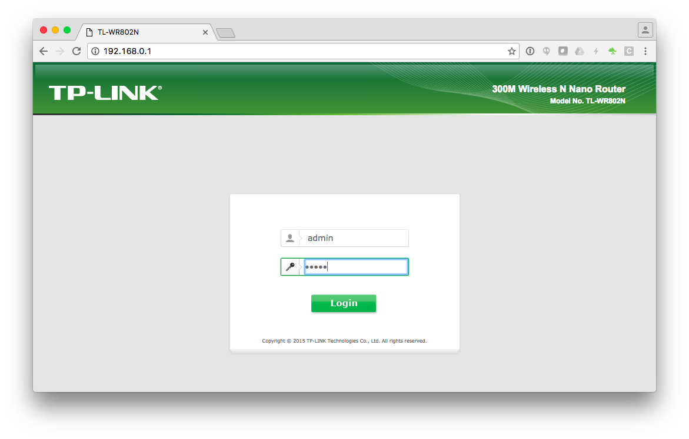

# Ausführen des Quick Setup - Operation Mode
Nach erfolgreicher Anmeldung kommt das Quicksetup. Hierzu muss der Operation Mode des Routers als `Wireless Router(Default)` definiert werden. 
Das bedeutet das der Router sich den Zugang zum Nächsten Netz / Internet über den LAN Port holt.
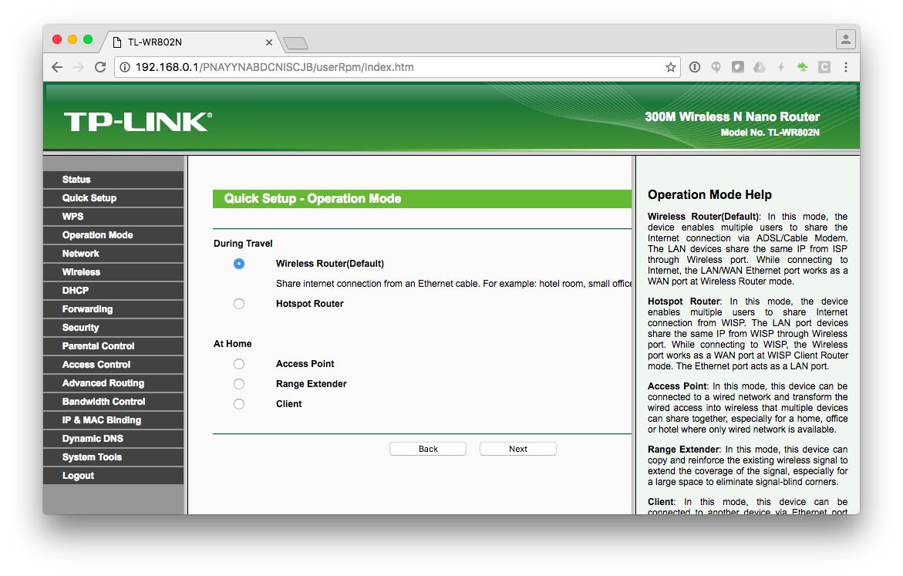

# Ausführen des Quick Seup - WAN Connection Type
Nachdem wir den Router als Router definiert haben. Möchte dieser Wissen wie über den WAN Port sich den Zugang über die diversen angebotenen Protkolle eine Verbindung holt.

Wir wählen hier Dynamic IP das bedeutet das der Router einen DHCP Client nutzt um für den WAN Port eine IP zu bekommen. Hierfür muss das da hinterliegende Netz einen DHCP Server haben sonst funktoniert dies nicht.
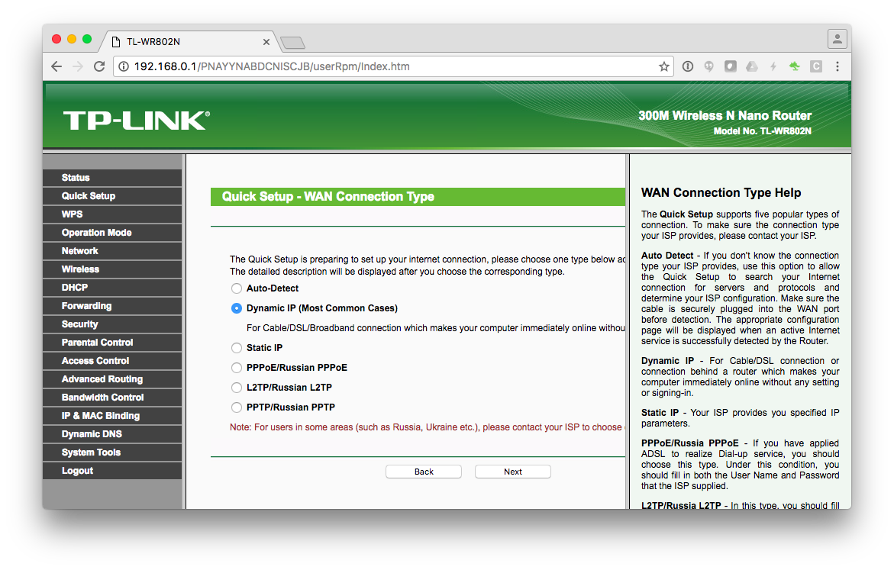

# Ändern der WLAN SSID und Passwirt
Wir haben alle unsere SSID's nach einem schema `bee42-crew-crewnummer`. Hierzu wählt ihr das passende Schema für eure Crew oder kommt bei uns an Board und nimmt nur eine eigene Crew Nummer.
Das WLAN-Passwort für die WLAN's ist bei uns immer `beehive42`. 


Nach der Einstellung des WLAN wird nochmal eine Übersicht der vorgenommen Einstellungen angezeigt. Anschließend drückt man auf den *Finish Button* und der Router startet mit der neuen WLAN Konfiguration neue . 


# Anmelden in dem Crew WLAN

Nun sollte das WLAN bei euch unter den Verfügbaren WLAN Netzen angezeigt werden. Wir haben hier ein Screenshot für unsere Beispiel Konfiguration erstellt.

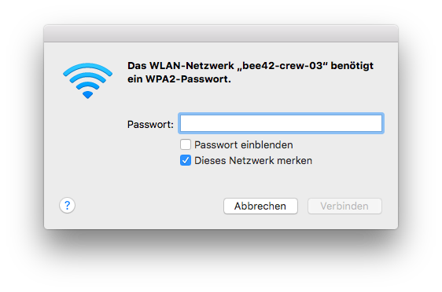

Eingeben des WLAN-Pasworts `beehive42`
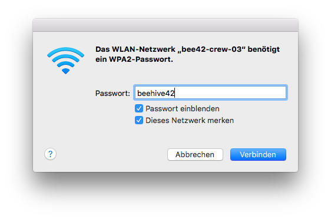

# Anmelden über den WLAN auf der Router WLAN 
Hier zu wählen wieder die `192.168.0.1`
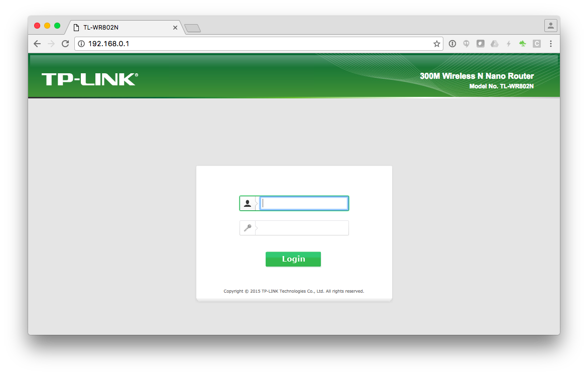

Anschließend sollten wir eine Status 
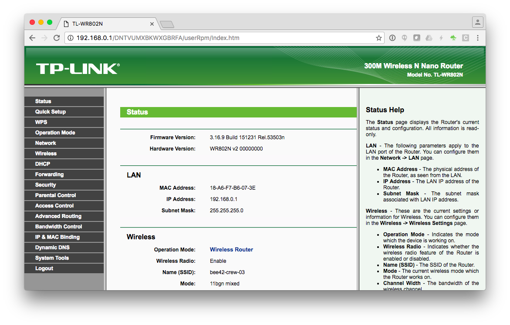

# Ändern des Hostnames
Wir änderen den Hostname des Routers um im hinterliegenden Netz eine einfache zu Ordnung zu der IP Addresse machen können. 
Hierfür hahebn wir einfach die IP Range im dem dahinter liegenden Netz mittels nmap gescannt. Als Schema für den Hostname nehmen wir `bee42-crew-crewnummer` es ist ähnlich zur WLAN SSID.
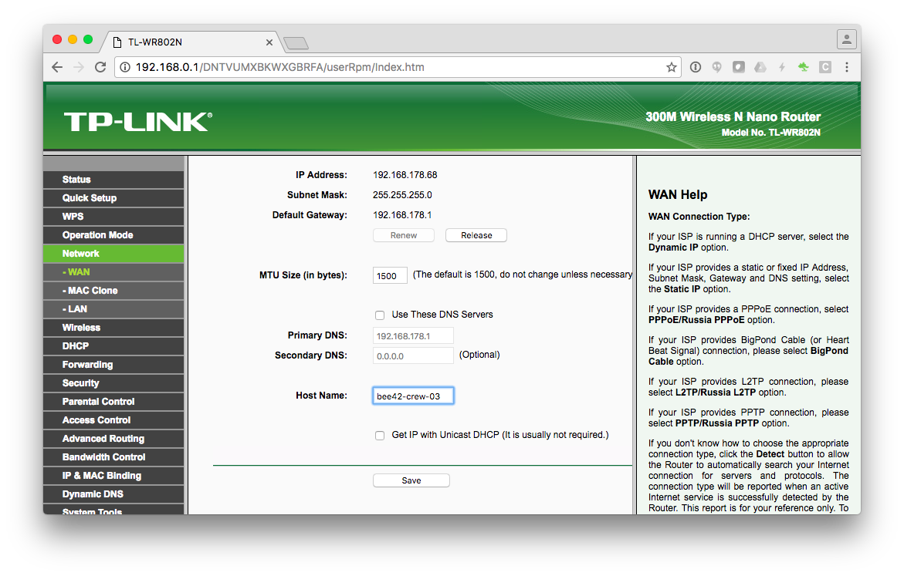

# Ändern der IP Adresse des Routers
Wir änderen die Router IP zu dem Netz der Crew Nummer und der Router bekommt die höchste IP Adresse in diesem Netz. Bei uns ist das Schema dafür wie folgt. 
`192.168.crewnummer.254` . Wir wählen hier die `254` Dann haben wir noch 253 mögliche Adressen für alle Clients im Netz. 
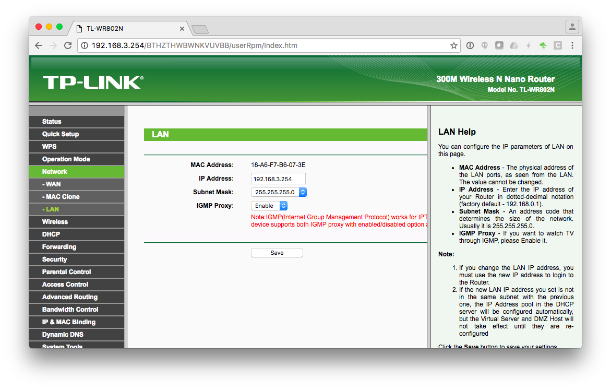

Nach Ändern der IP Addresse des Routers wird automatisch wieder ein Reboot durchgeführt.
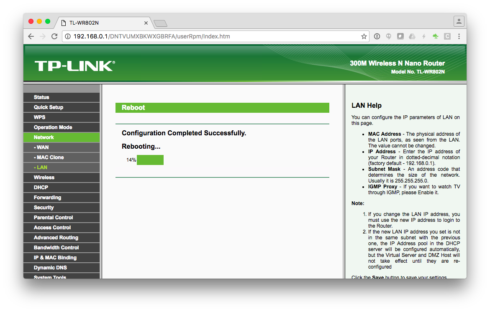

# Neu Anmeldung im Router
Da wir die IP Adresse des Routers geändert haben müssen wir uns jetzt erneut Anmelden.
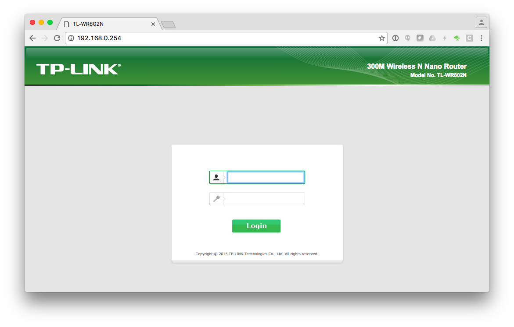

# Einstellen des DHCP Servers

Hierfür wählen wir unter DHCP die DHCP Settings aus. Nun ist die Konfigration wie folgt.

- Start IP Adress: `192.168.crewnummer.1`

- End IP Address: `192.168.crewnummer.253`

- Address Lease Time: 600 *Die zugewiesene IP Adresse ist somit 10 Stunden gültig*

- Default Gateway: `192.168.crewnummer.254`

- Default Domain: `bee42`

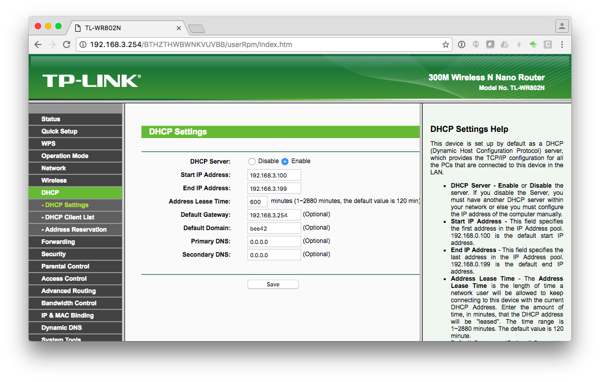

# Deaktivieren der Firewall
Um eine relative einfache Konfiguration zu haben. Deaktivieren wir die Firewall damit wir nicht alle Ports filter müssen die wir für unseren Versuch brauchen.
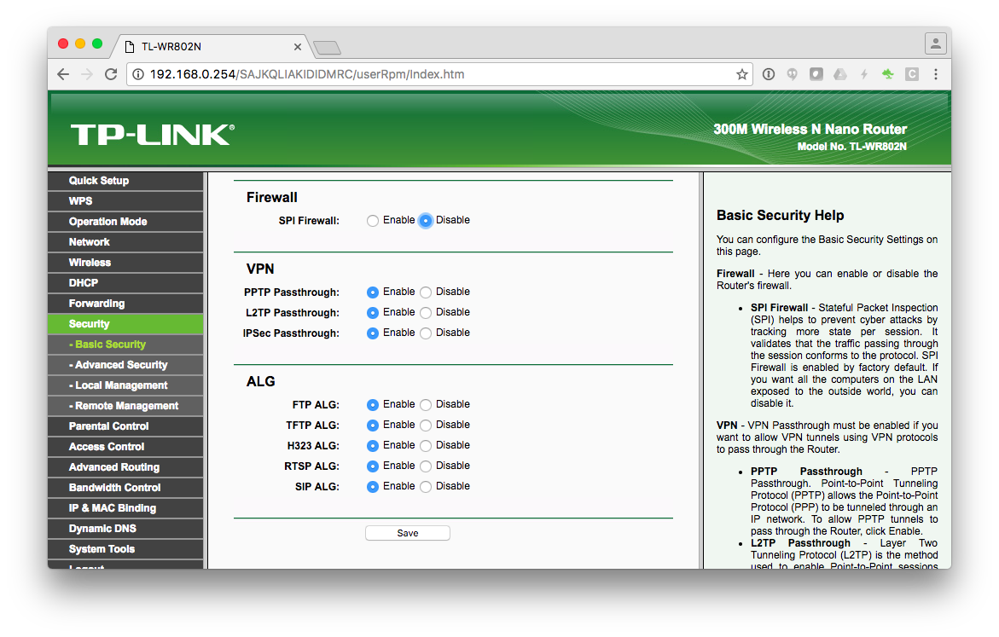

# Ändern des Router Nutzer und Ändern des Nutzer Passwords

Hierfür müssen zu erst die alten Daten eingeben werden. Anschließend kann in den unteren Feldern die neuen Daten vergeben. 

**Wichtig** Es müssen hier alle Felder ausgefühlt werden und die Anzahl der Zeichen ist auf eine Länge von `15` begrenzt.

Wenn man den selben Nutzernamen haben möchte setzt man einfach den neuen Nutzer Namen auf den Wert des alten.

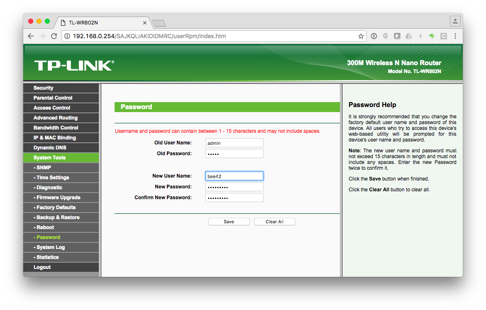

# Feste IP Adress Vergabe

Um unsere PI's einfach im Netz finden zu können vergeben wir diesen Feste IP's über die Address Reservation. Hierfür Gehen wir unter DHCP auf Adress Reservation und drücken den *Add New... Button*.
Hier wird nach der MAC Adresse des Netzwerk Interfaces am RPI gefragt und die gewünschte IP Adresse. Hier für haben wir folgedenes Schema bei unseren 3 PI's gewählt. 
Die `192.168.crewnummer.1` ist ein *Manager Node* . 
Die anderen beiden IP Addresen also die `192.168.crewnummer.2` und die `192.168.crewnummer.3` sind *Worker Nodes* . 

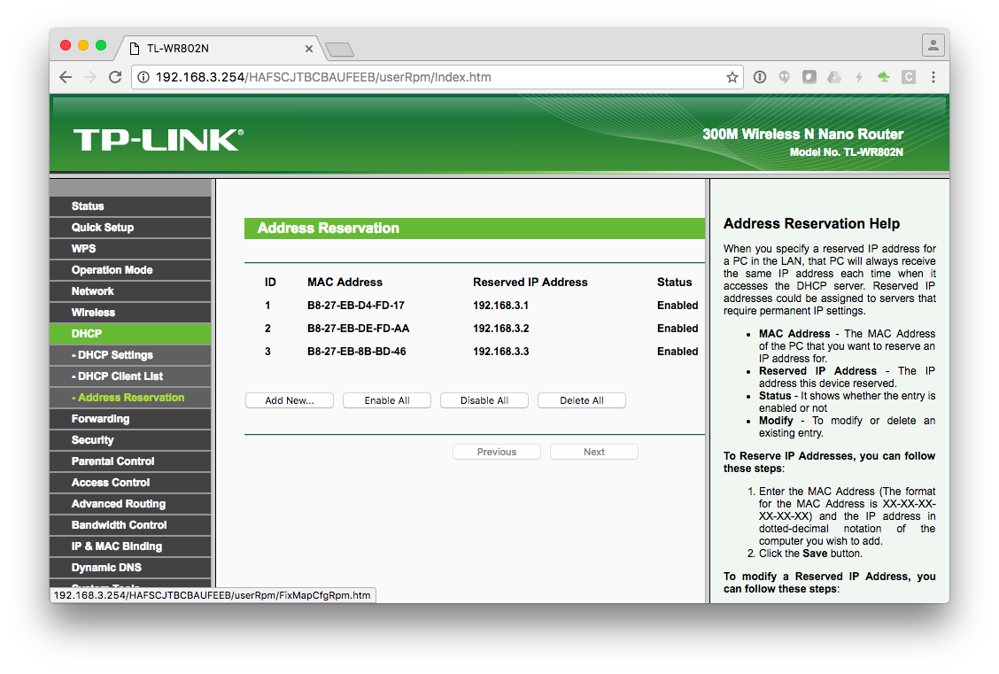

Um zu überprüfen ob die PI's auch die IP Addresse bekommen haben schauen wir uns die DHCP Client List an die auch unter DHCP zu finden ist.
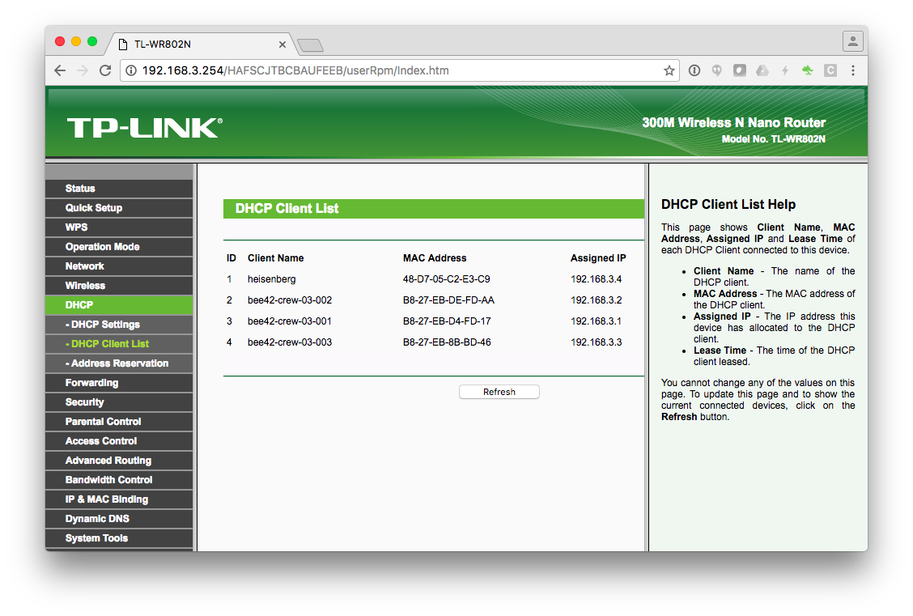


