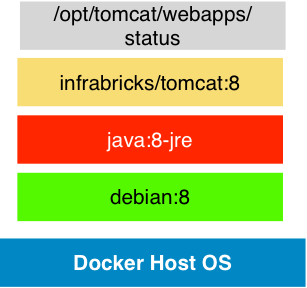
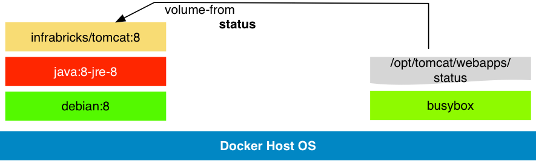

# Flexible Rpi Docker Apache Tomcat 8 Container


* Based on bee42/rpi-java:8-jre openjdk java jre-8
* Install a Apache Tomcat 8 Basic distribution
* Add jolokia jmx rest api to the distribution
* Tuned server.xml and logging.properties for production
* Access Log to stdout
* Drop all webapps and unused files
* Show some docker tricks
  * My webapp and tomcat docker composition pattern
  * JDK and Tomcat as docker data volume
  * Easy overwrite or extend Tomcat configs, webapps or libs



This implements some ideas from my german [tomcat blog post](http://www.infrabricks.de/blog/2014/12/19/docker-microservice-basis-mit-apache-tomcat-implementieren/).

Another minimal tomcat docker container example can you found at my github project [docker-simple-tomcat8](https://github.com/infrabricks/docker-simple-tomcat8).

## Build

Create RPI images with `./build.sh`
Tomcat is small but Java with debian consume more then >497mb

## Use the images

Information about the installed tomcat version:

```bash
$ docker run --rm --entrypoint=/opt/tomcat/bin/version.sh bee42/tomcat:8
Server version: Apache Tomcat/8.0.22
Server built:   Apr 29 2015 11:46:15 UTC
Server number:  8.0.22.0
OS Name:        Linux
OS Version:     3.18.11-tinycore64
Architecture:   amd64
JVM Version:    1.8.0_40-internal-b27
JVM Vendor:     Oracle Corporation
```

### Start a tomcat with simple webapp

```bash
$ mkdir -p webapps/status
$ cat >webapps/status/index.jsp <<EOF
<%@ page session="false" %>
<%=new java.util.Date()%>
EOF
$ CID=$(docker run -d -p 8002:8080 -v `pwd`/webapps/status:/opt/tomcat/webapps/status bee42/tomcat:8)
$ docker logs $CID
 => Creating and admin user with a random password in Tomcat
 => Done!
 ========================================================================
 You can now configure to this Tomcat server using:

     admin:ZwJq6Eqq7Ik4

 ========================================================================
 Checking *.war in /webapps
 Checking tomcat extended libs *.jar in /libs
              |   |
              |   |
              | # |
              #####
              ##+##
               #+#
            \   #   /
             `--+--´
              / ' \
             /     \
            /       \
           /         \
          /           \
         /             \
        /               \
       /                 \
      /                   \
     /     INFRABRICKS     \
    /          LINE         \
   /                         \
  / peter.rossbach@bee42.com  \
  #############################
  #!#!#!#!#!#!#!#!#!#!#!#!#!#!#
  #!#!#!#!#!#!#!#!#!#!#!#!#!#!#
  #!#!#!#!#!#!#!#!#!#!#!#!#!#!#
  #!#!#!#!#!#!#!#!#!#!#!#!#!#!#
  #!#!#!#!#!#!#!#!#!#!#!#!#!#!#
  #############################
     Power by Apache Tomcat
   https://tomcat.apache.org
2015-05-26T05:51:45.689+0000 org.apache.catalina.startup.VersionLoggerListener log INFO: Server version:        Apache Tomcat/8.0.22
2015-05-26T05:51:45.690+0000 org.apache.catalina.startup.VersionLoggerListener log INFO: Server built:          Apr 29 2015 11:46:15 UTC
2015-05-26T05:51:45.691+0000 org.apache.catalina.startup.VersionLoggerListener log INFO: Server number:         8.0.22.0
2015-05-26T05:51:45.692+0000 org.apache.catalina.startup.VersionLoggerListener log INFO: OS Name:               Linux
2015-05-26T05:51:45.694+0000 org.apache.catalina.startup.VersionLoggerListener log INFO: OS Version:            3.18.11-tinycore64
2015-05-26T05:51:45.694+0000 org.apache.catalina.startup.VersionLoggerListener log INFO: Architecture:          amd64
2015-05-26T05:51:45.695+0000 org.apache.catalina.startup.VersionLoggerListener log INFO: Java Home:             /usr/lib/jvm/java-8-openjdk-amd64/jre
2015-05-26T05:51:45.700+0000 org.apache.catalina.startup.VersionLoggerListener log INFO: JVM Version:           1.8.0_40-internal-b22
2015-05-26T05:51:45.701+0000 org.apache.catalina.startup.VersionLoggerListener log INFO: JVM Vendor:            Oracle Corporation
2015-05-26T05:51:45.702+0000 org.apache.catalina.startup.VersionLoggerListener log INFO: CATALINA_BASE:         /opt/tomcat
2015-05-26T05:51:45.703+0000 org.apache.catalina.startup.VersionLoggerListener log INFO: CATALINA_HOME:         /opt/tomcat
2015-05-26T05:51:45.704+0000 org.apache.catalina.startup.VersionLoggerListener log INFO: Command line argument: -Djava.util.logging.config.file=/opt/tomcat/conf/logging.properties
2015-05-26T05:51:45.705+0000 org.apache.catalina.startup.VersionLoggerListener log INFO: Command line argument: -Djava.util.logging.manager=org.apache.juli.ClassLoaderLogManager
2015-05-26T05:51:45.705+0000 org.apache.catalina.startup.VersionLoggerListener log INFO: Command line argument: -Duser.language=en
2015-05-26T05:51:45.706+0000 org.apache.catalina.startup.VersionLoggerListener log INFO: Command line argument: -Duser.country=US
2015-05-26T05:51:45.707+0000 org.apache.catalina.startup.VersionLoggerListener log INFO: Command line argument: -Xmx512m
2015-05-26T05:51:45.708+0000 org.apache.catalina.startup.VersionLoggerListener log INFO: Command line argument: -Djava.awt.headless=true
2015-05-26T05:51:45.708+0000 org.apache.catalina.startup.VersionLoggerListener log INFO: Command line argument: -DjvmRoute=49150bc5bcba
2015-05-26T05:51:45.709+0000 org.apache.catalina.startup.VersionLoggerListener log INFO: Command line argument: -Dtomcat.maxThreads=250
2015-05-26T05:51:45.710+0000 org.apache.catalina.startup.VersionLoggerListener log INFO: Command line argument: -Dtomcat.minSpareThreads=4
2015-05-26T05:51:45.710+0000 org.apache.catalina.startup.VersionLoggerListener log INFO: Command line argument: -Dtomcat.httpTimeout=20000
2015-05-26T05:51:45.711+0000 org.apache.catalina.startup.VersionLoggerListener log INFO: Command line argument: -Dtomcat.ajpTimeout=410000
2015-05-26T05:51:45.712+0000 org.apache.catalina.startup.VersionLoggerListener log INFO: Command line argument: -Dtomcat.accessLogPattern=%{begin:yyyy-MM-ddTHH:mm:ss:SSSZ}t org.apache.catalina.valves.AccessLogValve access INFO: %h "%r" "%{Referer}i" "%{User-Agent}i" %s %b "%I" %D %S
2015-05-26T05:51:45.712+0000 org.apache.catalina.startup.VersionLoggerListener log INFO: Command line argument: -Djava.security.egd=file:/dev/./urandom
2015-05-26T05:51:45.713+0000 org.apache.catalina.startup.VersionLoggerListener log INFO: Command line argument: -Dsun.net.client.defaultReadTimeout=180000
2015-05-26T05:51:45.714+0000 org.apache.catalina.startup.VersionLoggerListener log INFO: Command line argument: -Dsun.net.client.defaultConnectTimeout=180000
2015-05-26T05:51:45.714+0000 org.apache.catalina.startup.VersionLoggerListener log INFO: Command line argument: -Djava.net.preferIPv4Stack=true
2015-05-26T05:51:45.714+0000 org.apache.catalina.startup.VersionLoggerListener log INFO: Command line argument: -Dsun.net.inetaddr.ttl=15
2015-05-26T05:51:45.715+0000 org.apache.catalina.startup.VersionLoggerListener log INFO: Command line argument: -Djava.rmi.server.hostname=127.0.0.1
2015-05-26T05:51:45.716+0000 org.apache.catalina.startup.VersionLoggerListener log INFO: Command line argument: -Djava.rmi.server.useLocalHostname=true
2015-05-26T05:51:45.717+0000 org.apache.catalina.startup.VersionLoggerListener log INFO: Command line argument: -Dcom.sun.management.jmxremote
2015-05-26T05:51:45.717+0000 org.apache.catalina.startup.VersionLoggerListener log INFO: Command line argument: -Dcom.sun.management.jmxremote.ssl=false
2015-05-26T05:51:45.718+0000 org.apache.catalina.startup.VersionLoggerListener log INFO: Command line argument: -Dcom.sun.management.jmxremote.authenticate=false
2015-05-26T05:51:45.718+0000 org.apache.catalina.startup.VersionLoggerListener log INFO: Command line argument: -Djava.endorsed.dirs=/opt/tomcat/endorsed
2015-05-26T05:51:45.719+0000 org.apache.catalina.startup.VersionLoggerListener log INFO: Command line argument: -Dcatalina.base=/opt/tomcat
2015-05-26T05:51:45.719+0000 org.apache.catalina.startup.VersionLoggerListener log INFO: Command line argument: -Dcatalina.home=/opt/tomcat
2015-05-26T05:51:45.720+0000 org.apache.catalina.startup.VersionLoggerListener log INFO: Command line argument: -Djava.io.tmpdir=/opt/tomcat/temp
2015-05-26T05:51:45.839+0000 org.apache.coyote.AbstractProtocol init INFO: Initializing ProtocolHandler ["http-nio-8080"]
2015-05-26T05:51:45.853+0000 org.apache.tomcat.util.net.NioSelectorPool getSharedSelector INFO: Using a shared selector for servlet write/read
2015-05-26T05:51:45.856+0000 org.apache.coyote.AbstractProtocol init INFO: Initializing ProtocolHandler ["ajp-nio-8009"]
2015-05-26T05:51:45.857+0000 org.apache.tomcat.util.net.NioSelectorPool getSharedSelector INFO: Using a shared selector for servlet write/read
2015-05-26T05:51:45.858+0000 org.apache.catalina.startup.Catalina load INFO: Initialization processed in 683 ms
2015-05-26T05:51:45.897+0000 org.apache.catalina.core.StandardService startInternal INFO: Starting service Catalina
2015-05-26T05:51:45.898+0000 org.apache.catalina.core.StandardEngine startInternal INFO: Starting Servlet Engine: Apache Tomcat/8.0.22
2015-05-26T05:51:45.918+0000 org.apache.catalina.startup.HostConfig deployDirectory INFO: Deploying web application directory /opt/tomcat/webapps/status
2015-05-26T05:51:46.322+0000 org.apache.catalina.startup.HostConfig deployDirectory INFO: Deployment of web application directory /opt/tomcat/webapps/status has finished in 402 ms
2015-05-26T05:51:46.324+0000 org.apache.catalina.startup.HostConfig deployDirectory INFO: Deploying web application directory /opt/tomcat/webapps/jolokia
2015-05-26T05:51:46.581+0000 org.apache.catalina.core.ApplicationContext log INFO: jolokia-agent: Using access restrictor classpath:/jolokia-access.xml
2015-05-26T05:51:46.728+0000 org.apache.catalina.startup.HostConfig deployDirectory INFO: Deployment of web application directory /opt/tomcat/webapps/jolokia has finished in 405 ms
2015-05-26T05:51:46.737+0000 org.apache.coyote.AbstractProtocol start INFO: Starting ProtocolHandler ["http-nio-8080"]
2015-05-26T05:51:46.740+0000 org.apache.coyote.AbstractProtocol start INFO: Starting ProtocolHandler ["ajp-nio-8009"]
2015-05-26T05:51:46.741+0000 org.apache.catalina.startup.Catalina start INFO: Server startup in 882 ms
```

### Access the application

```
$ docker-machine ssh bee42-crew-01-001
> IP=$(docker inspect --format '{{ .NetworkSettings.IPAddress }}' ${CID})
> echo $IP
172.17.0.71
> curl -s http://$IP:8080/status/index.jsp
...
> exit
$ curl -s http://$(docker-machine ip bee42-crew-01-001):8002/status.jsp
...
```

### Use the tomcat manager



**tomcat-users.xml**

```xml
<?xml version='1.0' encoding='utf-8'?>
<<tomcat-users xmlns="http://tomcat.apache.org/xml"
  xmlns:xsi="http://www.w3.org/2001/XMLSchema-instance"
  xsi:schemaLocation="http://tomcat.apache.org/xml tomcat-users.xsd"
  version="1.0">

  <role rolename="manager-script"/>
  <user username="manager" password="tomcat" roles="manager-script"/>
</tomcat-users>
```

```bash
$ docker stop $CID
$ docker rm $CID
$ docker run -d -p 8002:8080 \
 -v `pwd`/webapps/status:/opt/tomcat/webapps/status \
 -v `pwd`/tomcat-users-xml:/opt/tomcat/conf/tomcat-users.xml \
infrabricks/tomcat:8
$ CID=$(docker ps -lq)
$ IP=$(docker inspect --format '{{ .NetworkSettings.IPAddress }}' ${CID})
$ curl -su manager:tomcat http://$(docker-machine ip bee42-crew-01-001):8002/manager/text/list
OK - Listed applications for virtual host localhost
/status:running:0:status
/manager:running:0:manager
/jolokia:running:0:jolokia
```

### Use Jolokia

```
$ docker exec -ti tomcat8_tomcat_1 /bin/bash
> curl 127.0.0.1:8080/jolokia/version | jq "."
{
  "request": {
    "type": "version"
  },
  "value": {
    "agent": "1.3.0",
    "protocol": "7.2",
    "config": {
      "maxCollectionSize": "0",
      "agentId": "172.17.0.115-1-e2dd000-servlet",
      "debug": "false",
      "agentType": "servlet",
      "serializeException": "false",
      "detectorOptions": "{}",
      "dispatcherClasses": "org.jolokia.jsr160.Jsr160RequestDispatcher",
      "maxDepth": "15",
      "discoveryEnabled": "false",
      "canonicalNaming": "true",
      "historyMaxEntries": "10",
      "includeStackTrace": "true",
      "maxObjects": "0",
      "debugMaxEntries": "100"
    },
    "info": {
      "product": "tomcat",
      "vendor": "Apache",
      "version": "8.0.22"
    }
  },
  "timestamp": 1432619866,
  "status": 200
}
> curl -Ls 127.0.0.1:8080/jolokia/read/java.lang:type=Memory | jq "."
{
  "request": {
    "mbean": "java.lang:type=Memory",
    "type": "read"
  },
  "value": {
    "ObjectPendingFinalizationCount": 0,
    "Verbose": false,
    "HeapMemoryUsage": {
      "init": 33554432,
      "committed": 74448896,
      "max": 477626368,
      "used": 40225920
    },
    "NonHeapMemoryUsage": {
      "init": 2555904,
      "committed": 35454976,
      "max": -1,
      "used": 34108888
    },
    "ObjectName": {
      "objectName": "java.lang:type=Memory"
    }
  },
  "timestamp": 1432619913,
  "status": 200
}
```

* [Jolokia Reference Manual](https://jolokia.org/reference/html/index.html)
* Review the restrictions at `lib/jolokia-access.xml`

### Change version

Set TOMCAT_VERSION at this files:

* build.sh
* Dockerfile

**WARNING**: Check gpg keys from authors site if you change the version!

jolokia

```
gpg --verify jolokia.war.asc
gpg --keyserver pgpkeys.mit.edu --recv-key EF101165
#Roland Huss <roland@jolokia.org>
```

Apache Tomcat

* https://www.apache.org/info/verification.html
* Tomcat Keys file http://svn.apache.org/repos/asf/tomcat/trunk/KEYS

## Tomcat RasPi Support

Create your Raspberry PI BASE SD from hypriot

http://blog.hypriot.com/
http://blog.hypriot.com/getting-started-with-docker-on-your-arm-device/

```
docker build -t bee42/tomcat:rpi-8.0.38 -f Dockerfile .
docker build -t bee42/rpi-status -f Dockerfile.status .
docker run --name status bee42/rpi-status /bin/true
docker run -d -p 8080:8080 --volumes-from status bee42/tomcat:rpi-8.0.38
```

*WARNING*: Starting simple apps at tomcat needs time!

### ToDo Missing jq

Build static binary with C-Container and add to tomcat.

*Idea*: But not a static binary and must remove tools!

```
FROM resin/rpi-raspbian:wheezy
RUN  apt-get update \
  && apt-get install -y libapr1-dev libssl-dev gcc tar make \
  && curl -O https://github.com/stedolan/jq/downlods/source/jq-1.4.tar.gz \
  && tar xvz jq-1.4.tar.gz \
  && cd jq-jq-1.4 \
  && autoreconf -i \
  && ./configure \
  && make -j8 \
  && make check \
  && make install
ENTRYPOINT ["jq"]
CMD ["."]
```


## Use other versions or options

Use a older Tomcat with more max jvm memory

```
$ docker build \
 --build-arg TOMCAT_MINOR_VERSION=8.0.35 \
 --build-arg JAVA_MAXMEMORY=1024 \
 -t bee42/tomcat:rpi-8.0.35-1\
 -f Dockerfile \
 git://github.com/bee42/docker-on-rpi-lab#:examples/docker/rpi-tomcat-8
```

more to change

* JOLOKIA_VERSION=1.3.3
* TOMCAT_MAXTHREADS=250

## User Feedback

See my [infrabricks blog](http://www.infrabricks.de) to more informations.

Contact me: Peter <peter.rossbach@bee42.com>

Follow me [on Twitter](https://twitter.com/PRossbach)

### Issues

If you have any problems with or questions about this image, please contact us through a GitHub issue.

* [infrabricks-line](https://github.com/infrabricks/infrabricks-line)


* Setting unique JVM_ROUTE that can be used as mod_jk worker name
* build all container with Docker Hub CI
* mod_jk integration

### Contributing

You are invited to contribute new features, fixes, or updates, large or small; we are always thrilled to receive pull requests, and do our best to process them as fast as we can.

Before you start to code, we recommend discussing your plans through a GitHub issue, especially for more ambitious contributions. This gives other contributors a chance to point you in the right direction, give you feedback on your design, and help you find out if someone else is working on the same thing.

## Power by Apache Tomcat


## References

* [Apache Tomcat](https://tomcat.apache.org)
* [Docker](https://docker.com)
* [Infrabricks Blog](http://www.infrabricks.de)
* [Tomcat Docker hub library images](https://registry.hub.docker.com/u/library/tomcat/)
* [jolokia](http://www.jolokia.org/)
* [Docker maven plugin](https://github.com/rhuss/docker-maven-plugin)

Regards,
Peter
