# Docker on ARM

```
<dieter@hypriot.com> @Quintus23M
Docker Captain && Hypriot Pirate

&&

<peter.rossbach@bee42.com> @PRossbach
bee42 solutions gmbh
```

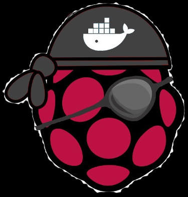

***
be(e) not perfect...
---
## What's going on?

* IOT-hardware and mobiles everywhere
* Software services running at the cloud
* Software must be faster available
* Produce software with higher quality
* Make your services globally available
* Improve your service with customer feedback
* Reduce your cost
* Automate all
* Cooperate with a purpose - Create API's
* Secure your customer data

-
### Think...


## Understand the real purpose
## and
## what your customers really need!

## and then

ask a lot of them...

-
### Start with DevOps

## You Build    It
## You Ship     It
## You Run      It
## You Automate It
## You Test     It
## You Measure  It
## You Change   It

---
## Docker-Mantra!

**B**uild, Ship and Run

**A**ny App,

**A**nywhere


-
## Docker simple answer

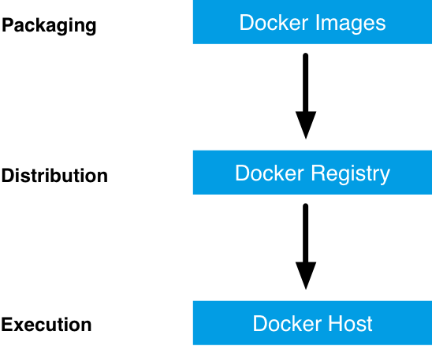
***
deliver prepackage and ready to run software

-
### Now the fun starts...


-
### Run anywhere means

  * Docker works locally, at the cloud and your IOT devices
  * with the **same** binary
    * with the **same** functionality
    * with the **same** version
    * with the **same** filesystem layout
    * with the **same** dependencies
  * but currently with different Linux kernels!  

***
* This dream is now reality...
* => **The system is the asset**
* => **Code is a liability**
* **Chad Fowler**

-
## Docker Container has a lower resource consumption

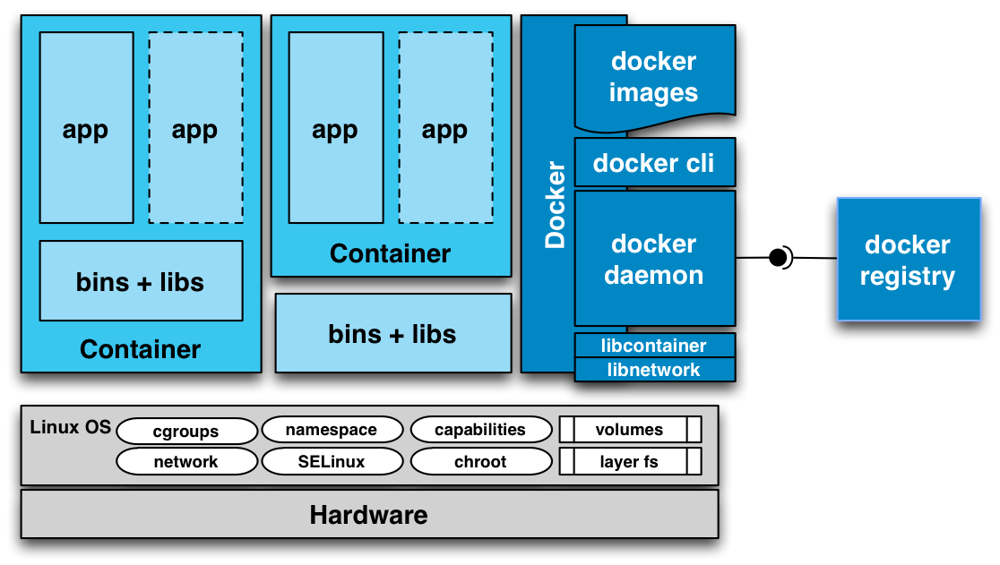
***
Use Linux at bare metal or a virtual machine provider
-
## Docker is today the first
## public accepted
## container technology

***
but there exists a lot of competitors<br/>
CoreOS Rocket | pure LXC | Ubuntu joyent | SmartOS | Open Container runc...

---
## Today - Docker On ARM is available

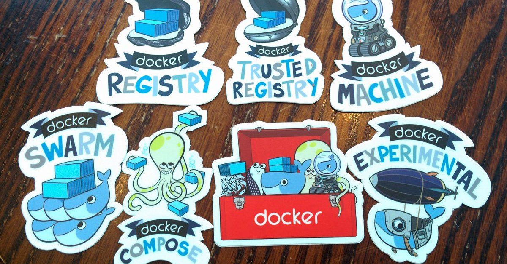

  * Docker Engine 1.12.2
    * Docker native orchestration
    * Official Docker on ARM support started
  * Docker for Mac/Windows and Azure/AWS
  * Docker Machine Swarming on ARM

---
## Features from current Docker Engine

* Management of multiple Docker Hosts
* Native Windows Docker Client available
* Fast Image Loading ( Registry 2.2)
* Manage Resources (CPU, MEMORY, IO-Net, IO-Block)
* Manage Linux Security features
* Access Container metrics and logging
* Volume- und MultiHost Network-Management
* Native Mac and Windows and better cloud support
* Native Windows- and ARM-Container support
* Clustering and Orchestration support

---
## Docker basics: Demo (build)

```
$ docker-machine ssh bee42-crew-01-001
# ssh pirate@192.168.<crewid>.<pi machine id>
# password hypriot
$ docker run -ti --rm queenshive:5000/bee42/rpi-alpine
$ cat >Dockerfile <<EOF
FROM resin/rpi-raspbian:jessie
MAINTAINER Peter Rossbach <peter.rossbach@bee42.com> @PRossbach
RUN apt-get update && apt-get install -y \
    apache2 \
    --no-install-recommends && \
    rm -rf /var/lib/apt/lists/*
EXPOSE 80
CMD [ "apache2ctl", "-D", "FOREGROUND", "-k", "start" ]
EOF
$ docker build -t bee42/rpi-apache:0.1 .
```

-
### Docker basics: Demo (run/ship)
```
# test locally and then ship it
$ docker run -p 80 -d bee42/rpi-apache:0.1
$ docker logs $(docker ps -lq)
$ docker tag bee42/rpi-apache:0.1 queenshive:5000/bee42/rpi-apache:0.1
$ docker push queenshive:5000/bee42/rpi-apache:0.1
# run at every ARMv7 system
$ docker run -d -p 80:80 queenshive:5000/bee42/rpi-apache:0.1
```
-
### Review the minimal httpd Images

* https://hub.docker.com/_/httpd/
  * Based on alpine linux distribution
  * Compiled from source
  * Run at FOREGROUND
  * Send Logs to stdout/stderr
  * All mods
  * user www-data
  * valid security check
* use the lable schema
  * http://label-schema.org/rc1/

-
### Types of containers

* Service Container
  * Stateless
  * Stateful
* Process Container
* Tool Container
* Data Container
* Desktop Process Container
  * https://github.com/jessfraz/dockerfiles

-
### Hint: Ask you...

* Which real purpose has my image?
* Is it a hack or more?
* Exits a simpler or better software for the same purpose?
* Why I need a complete base linux distribution?
* Which Meta-Information the customer needed?
* Which lisence you must add?
* Which configuration the service needed?
* Can my customer monitoring the service?
* Which things can break my service?
* Is trust important for my customer?
* Which security checks you image need?

---
## Docker Orchestration with SwarmKit

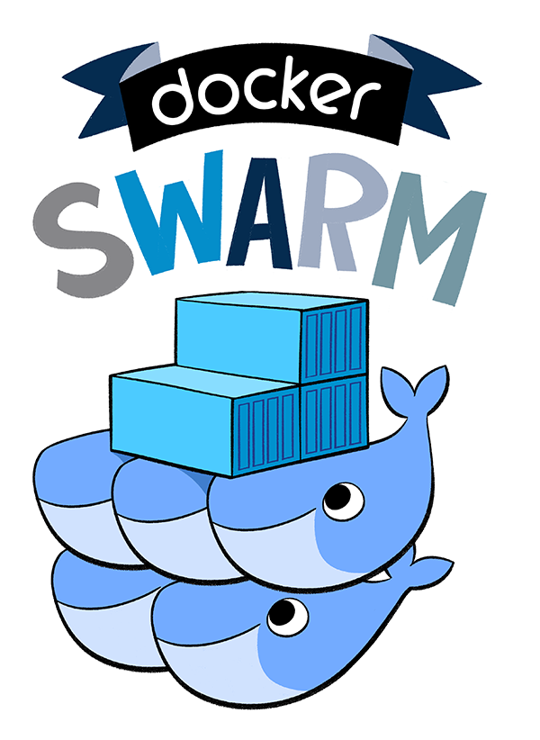

-
### Swarmkit: Overview
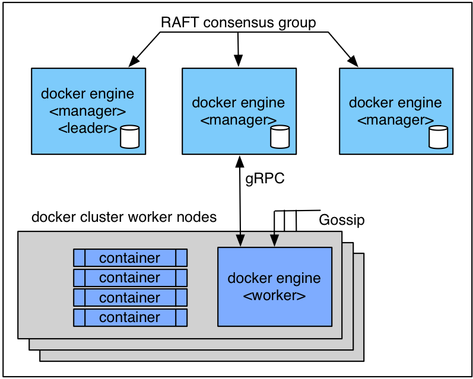

-
### Docker swarming: Orchestration

* Desired State Reconciliation
* Service Types
  * Replicated Services
  * Global Services
* Configurable Updates
  * Parallelism
  * Delay
* Restart Policies

-
### Docker swarming: Scheduling method

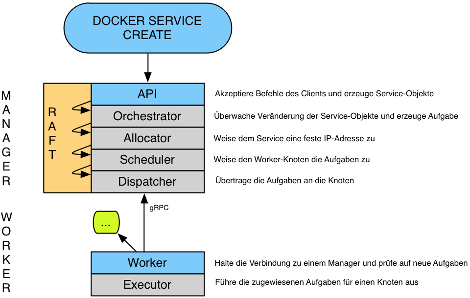

-
### Docker swarming: Scheduling details
* Resource Awareness
* Constraints
  * __IDs__
  * __names__
  * __labels__ (e.g. `node.labels.foo!=bar1`)
* Strategies
  * spread strategy
  * least loaded nodes
  * respect the constraints
  * respect the resource requirements

-
### Docker swarming: Cluster Management

* State Store
  * replicated (Raft based)
  * extremely fast (in-memory reads)
  * save snapshots
* Topology Management
  * managers
  * workers
* Node Management
  * Pause/unpause
  * drain/activate
  * failure detection

-
### Docker swarming: Security

* Mutual TLS
  * CA
  * Manage certs to all nodes
* Acceptance Policy
  * auto accept
  * manually accept
  * require a secret to join the cluster
* Certificate Rotation
  * rotated and reloaded transparently on every node
  * default is 3 months, the minimum is 30 minutes

-
### Flash your RPI-device

#### Install flash

```
$ URL=https://raw.githubusercontent.com/hypriot/flash/master
$ curl -O $URL/$(uname -s)/flash
$ chmod +x flash
$ sudo mv flash /usr/local/bin/flash
```

#### flash your SD Cards

```
$ flash \
  --hostname bee42-crew-06-003 \
  --ssid bee42-crew-06 \
  --password beehive42 \
  https://downloads.hypriot.com/hypriotos-rpi-v1.1.0.img.zip
```

-
### Example I:  whoami

* https://github.com/emilevauge/whoamI

```
$ docker run -d -P --name iamfoo queenshive:5000/bee42/rpi-whoami
$ docker inspect --format '{{ .NetworkSettings.Ports }}'  iamfoo
map[80/tcp:[{0.0.0.0 32769}]]
$ curl "http://0.0.0.0:32769"
Hostname :  6e0030e67d6a
IP :  127.0.0.1
IP :  ::1
IP :  172.17.0.27
IP :  fe80::42:acff:fe11:1b
GET / HTTP/1.1
Host: 0.0.0.0:32769
User-Agent: curl/7.35.0
Accept: */*
```

***
* `examples/docker/rpi-whoami`

-
### Example II: uuid

* `examples/docker/rpi-tomcat-8`

-
### Build cluster an join workers

```
$ docker $(docker-machine config bee42-crew-01-001) swarm init
$ MACHINE=bee42-crew-01-002
$ SWARM_TOKEN=`docker $(docker-machine config bee42-crew-01-001) \
 swarm join-token worker -q`
$ docker $(docker-machine config $MACHINE) swarm join \
 --token $SWARM_TOKEN \
 $(docker-machine ip bee42-crew-01-001):2377
```

Second terminal

```
$ docker-machine ssh bee42-crew-01-001
$ docker node ls
```

-
### Create a new service and scale

```
$ docker service create --name whoami queenshive:5000/bee42/whoami
$ docker service update --replicas 2  whoami
$ docker service inspect whoami
[
    {
        "ID": "ch1cizq1k61qigbswzdd0sryj",
        "Version": {
            "Index": 717
        },
        "CreatedAt": "2016-06-19T11:01:39.630354919Z",
        "UpdatedAt": "2016-06-19T11:02:20.137102719Z",
        "Spec": {
            "Name": "whoami",
...
]
$ docker service inspect whoami |jq "{ name: .[].Spec.Name , replicas: .[].Spec.Mode.Replicated.Replicas}"
{
  "name": "whoami",
  "replicas": 2
}
```

-
### docker service options

```
Usage:	docker service create [OPTIONS] IMAGE [COMMAND] [ARG...]

Create a new service

Options:
      --constraint value             Placement constraints (default [])
      --endpoint-mode string         Endpoint mode(Valid values: VIP, DNSRR)
  -e, --env value                    Set environment variables (default [])
      --help                         Print usage
  -l, --label value                  Service labels (default [])
      --limit-cpu value              Limit CPUs (default 0.000)
      --limit-memory value           Limit Memory (default 0 B)
      --mode string                  Service mode (replicated or global) (default "replicated")
  -m, --mount value                  Attach a mount to the service
      --name string                  Service name
      --network value                Network attachments (default [])
  -p, --publish value                Publish a port as a node port (default [])
      --replicas value               Number of tasks (default none)
      --reserve-cpu value            Reserve CPUs (default 0.000)
      --reserve-memory value         Reserve Memory (default 0 B)
      --restart-condition string     Restart when condition is met (none, on_failure, or any)
      --restart-delay value          Delay between restart attempts (default none)
      --restart-max-attempts value   Maximum number of restarts before giving up (default none)
      --restart-window value         Window used to evalulate the restart policy (default none)
      --stop-grace-period value      Time to wait before force killing a container (default none)
      --update-delay duration        Delay between updates
      --update-parallelism uint      Maximum number of tasks updated simultaneously
  -u, --user string                  Username or UID
  -w, --workdir string               Working directory inside the container
```
-
### Add a service to all nodes

```
$ eval $(docker-machine env swarm_master)
$ docker service create --name cadvisor --mode global \
 --mount type=bind,source=/,target=/rootfs/,writable=false \
 --mount type=bind,source=/var/run/,target=/var/run/ \
 --mount type=bind,source=/sys/,target=/sys/,writable=false \
 --mount type=bind,source=/var/lib/docker/,target=/var/lib/docker/,writable=false \
  --publish 8080:8080 \
  google/cadvisor:latest
```

***
* Add a new node, and service is started...
* **WARNING**: CAdvisor don't work at ARM at this moment!

-
### Rolling service update

UUID swarming

```
# login to swarm manager
$ docker build --build-arg UUID_VERSION=0.0.2 -t bee42/rpi-uuid:0.0.1 -f Dockerfile.uuid .
$ docker tag bee42/rpi-uuid:0.0.1 queenshive:5000/bee42/rpi-uuid:0.0.1
$ docker push queenshive:5000/bee42/rpi-uuid:0.0.1
$ docker service create --name uuid queenshive:5000/bee42/rpi-uuid:0.0.1
$ docker service update --publish-add 9080:8080 uuid
$ docker service update --replicas 2 uuid
```

UUID next version

```
$ docker build --build-arg UUID_VERSION=0.0.2 -t bee42/rpi-uuid:0.0.2 -f Dockerfile.uuid .
$ docker tag bee42/rpi-uuid:0.0.2 queenshive:5000/bee42/rpi-uuid:0.0.2
$ docker push queenshive:5000/bee42/rpi-uuid:0.0.2
$ docker service update \
 --replicas 4 \
 --update-delay 10s \
 --image queenshive:5000/bee42/rpi-uuid:0.0.2 uuid
```

-
### Access uuid service

```
$ curl 192.168.5.1:9080/uuid/index.jsp
{
  "Container": "9e1daabe3fb2",
  "UUID": "37a971b7-1467-47de-90e2-20cd2d9de4df",
  "Date": "2016/10/25 14:30:25",
  "Timestamp": "1477405825",
  "Version": "0.0.2"
}
```
-
### visualizer of docker swarming

```
$ docker run -it -d -p 5000:5000 \
  -e HOST=192.168.5.1 \
  -e PORT=5000 \
  -v /var/run/docker.sock:/var/run/docker.sock \
  queenshive:5000/bee42/swarm-visualizer
```

***
*  https://github.com/ManoMarks/docker-swarm-visualizer

-
### docker visualizer screenshot 1


-
### docker visualizer screenshot 2


-
### More to Test

* Auto update to next software release
  * A/B Testing
  * Canary Deployment
* Multi-Network Handling
* Control the liveness with Healthcheck
* Swarming with prometheus - no scraper at this moment!
* Create a Visualizer for complex setups
* Volume Management and Docker Plugin's
* Check the API
* DAB Format and docker-compose

-
### More Docker Swarming possible


---
## Docker-in-Docker with swarming mode at Docker For Mac

```
$ docker swarm init
$ SWARM_TOKEN=$(docker swarm join-token -q worker)
$ SWARM_MASTER=$(docker info | grep -w 'Node Address' | awk '{print $3}')
$ NUM_WORKERS=3
$ for i in $(seq "${NUM_WORKERS}"); do \
    docker run -d --privileged --name worker-${i} \
    --hostname=worker-${i} -p ${i}2375:2375 docker:1.12.2-dind \
      docker --host=localhost:${i}2375 \
      swarm join --token ${SWARM_TOKEN} ${SWARM_MASTER}:2377 \
done
$ docker run -it -d -p 8000:8000 \
    -e HOST=localhost -e PORT=8000 \
    -v /var/run/docker.sock:/var/run/docker.sock \
    manomarks/visualizer
```

***
* https://medium.com/@alexeiled/docker-swarm-cluster-with-docker-in-docker-on-macos-bdbb97d6bb07#.yry5s0jiv
* http://blog.terranillius.com/post/swarm_dind/
* https://github.com/ManoMarks/docker-swarm-visualizer

---
## Add an ingress loadbalancer like traefik

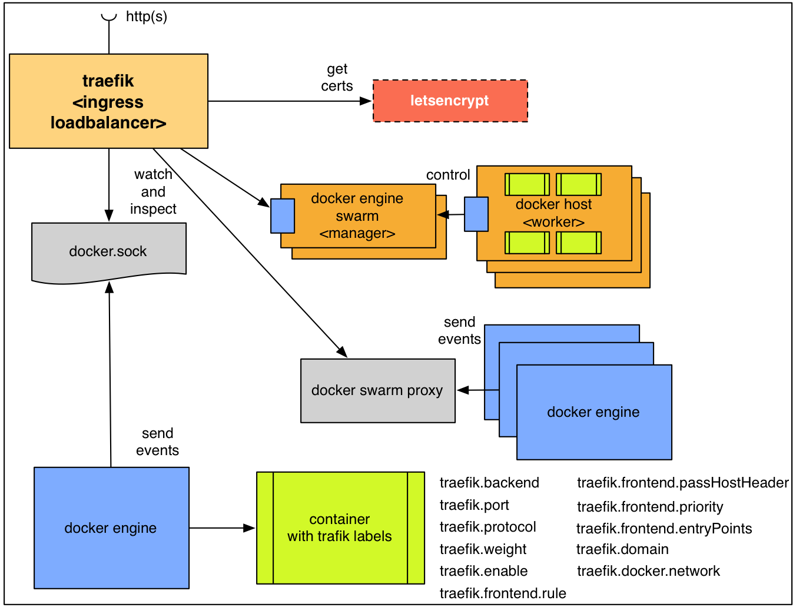

***
* https://traefik.io/
* setup external Ingress loadbalancer
* letsencrypt support
* docker swarming support
-
### Label your service container

```
traefik:
  image: traefik
  command: --web --docker --docker.domain=docker.localhost --logLevel=DEBUG
  ports:
    - "80:80"
    - "8080:8080"
  volumes:
    - /var/run/docker.sock:/var/run/docker.sock
    - /dev/null:/traefik.toml

whoami:
  image: emilevauge/whoami
  labels:
    - "traefik.backend=whoami"
    - "traefik.frontend.rule=Host:whoami.docker.localhost"
```

***
* __Example shows__: Access to one Docker Engine not a cluster
* __ToDo__: Present swarming mode - network and engine access?

-
### Traefik Dashboard


-
### Use with docker swarming cluster

* use old docker swarm
* use consul, etcd with registrator
* New docker swarm 1.12 provider needed! HELP!
  * https://github.com/containous/traefik/pull/602
  * Accepted for release v1.1.0-rc2

---
## Summary
-
### Containerize your software
### to create
### faster value
-
### Deploy and run software
### with
### Docker
### is now much easier
-
### Learn more
### to use a
### dynamic infrastructure
-
### Please,
### use cloud technologies and services
### at
### your
### daily business
-
### DevOps changes your organizational structure,
### to it first.
-
### You need
### more
### hardcore IT-knowledge
### at your teams
-
### Start an
### aggressive learning culture
### at your team
-
### Docker Ecosystem
### and
### the IT market
### growing
### and
### moving
### fast forward
-
### Don't forget

* Use a infrastructure first strategy
* Reduce you coupling
* Create brilliant API's
* Design for failure
* Setup machines and network automatically
* Safe your persistence data
* The system is the real asset
* Build your system for friends

---
## Contact

View the slides as a docker container

```bash
$ docker run -d -p 8000:80 \
 rossbachp/docker-on-arm:docker-meetup-bochum-2016-10
$ open http://<docker host>:8000/docker-on-arm
```

Slides available at container and PDF :-)

  * [<dieter@hypriot.com>](mailto:dieter@hypriot.com)
    * [@Qunitus23M](http://twitter.com/Qunitus23M)
    * [Hypriot Pirates](http://blog.hypriot.com)
  * [<peter.rossbach@bee42.com>](mailto:peter.rossbach@bee42.com)
    * [@PRossbach](http://twitter.com/PRossbach)
    * [Infrabricks Blog](http://www.infrabricks.de)
    * [bee42](http://www.bee42.com)

---
### Peter's offer to you!

| Service         | benefit                                         |
|:----------------|:------------------------------------------------|
| **Lab**:        | use my IT-brick knowledge to be faster informed |
| **Consulting**: | use my expertise to start smarter               |
| **Training**:   | let me help you to get a docker-brick expert    |
| **Products**:   | use my knowledge of the docker ecosystem        |

***
[<peter.rossbach@bee42.com>](mailto:peter.rossbach@bee42.com)

---
## Docker Meetup Bochum

## Docker on ARM - Embedded System Lab

* Dieter Reuter (@DockerCaptain, Hypriot Pirat)
* Peter Roßbach (Founder bee42, Docker Enabler, Apache Member, Systemarchitect)
* Niclas Mietz (Docker Nerd)

***
* Docker Meetup 25.10 2016 - 18 Uhr Bochum - Jahrhunderthaus
* http://www.meetup.com/de-DE/Docker-Bochum/events/234324255/
* https://github.com/bee42/docker-on-rpi-lab

-
### Pi Swarming

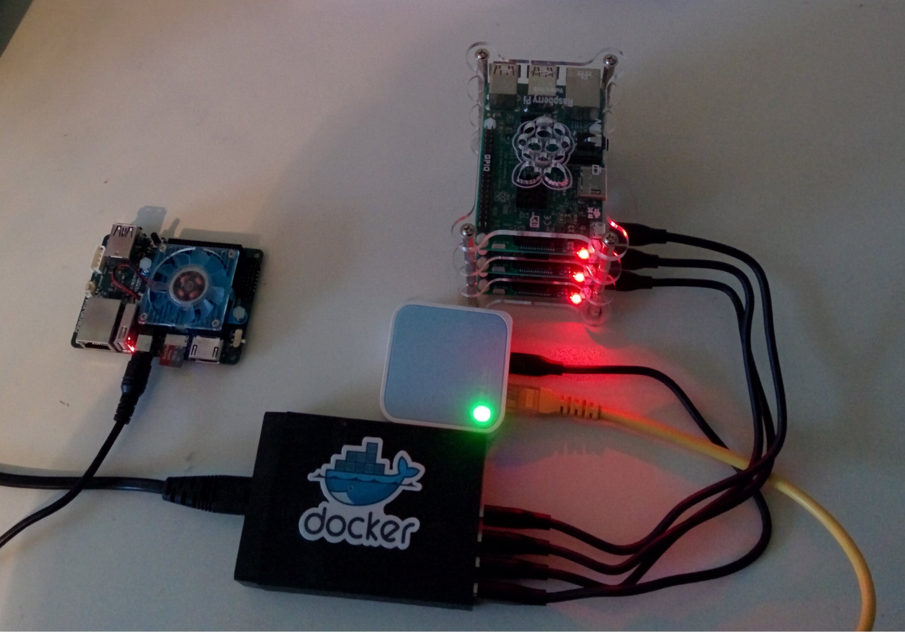

---
## Docker Meetup Lab impressions

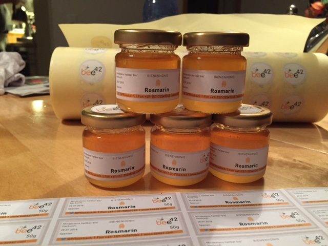

***
* bee42 crew meets docker community!

-
## Docker Meetup Lab Opening

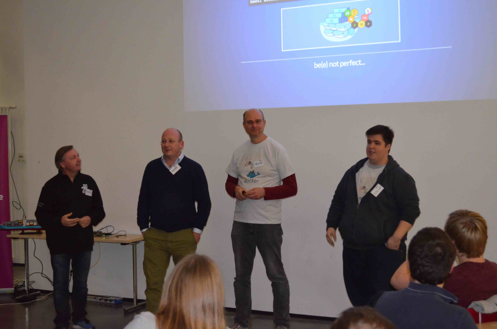

***
* YEAH with Dieter, Guido, Peter and Niclas

-
## Docker Meetup Lab: Sponsor Setlog

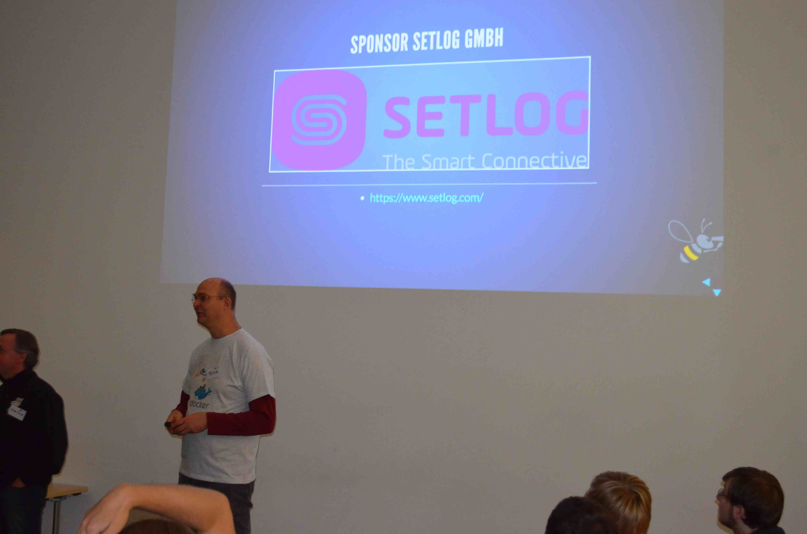

-
### Hack the Lab: docker swarming development

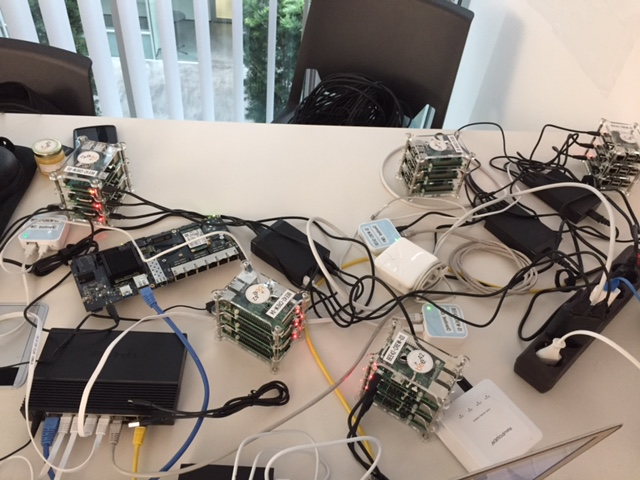

***
* Many Thanks to Niclas, Albert, Dmitry and Georg!

-
### Hack the Lab: Delivery of the router

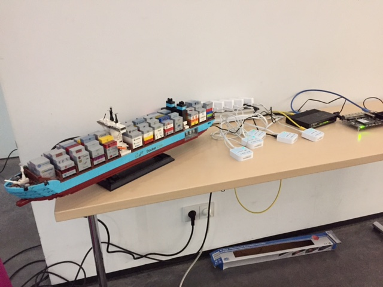

-
### Hack the Lab: Crew docker swarming setup

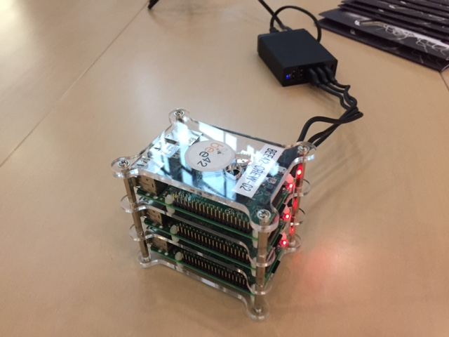

-
### Hack the Lab: bring your own device...

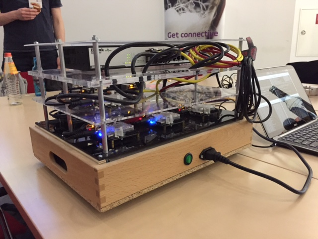

-
### Hack the Lab: bring your own device...

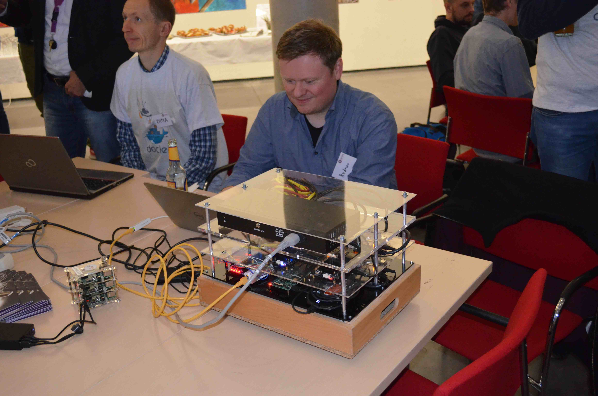

***
* Many Thanks to Andreas:  Your ODRIOD setup is brilliant!

---
## More time for discussions...

  - Docker Meetup 25.10 2016 - Bochum
    - Docker on ARM - Hackergarden
  - W-JAX 5-9.11 2016 - Munich
  - Container Camp 15/16.11 - Darmstadt
  - Global Docker Mentoring Week
    - Docker Meetup Groups Düsseldorf & Bochum - 17.11 Düsseldorf
    - Sponsor inVision && bee42
    - https://blog.docker.com/2016/10/docker-global-mentor-week-2016/
    - http://www.meetup.com/de-DE/docker-dus/events/234915297/
  - DevOpsCon 5-8.12 2016 - Munich
    - Docker Basics
    - Docker Advanced OpenSpace
  - DockerCamp 12-14.12 2016 - Berlin
  - Find my training offerings at
    - http://www.bee42.com/training/
    - http://devops-training.de

---
## Open the doors for Q&A...

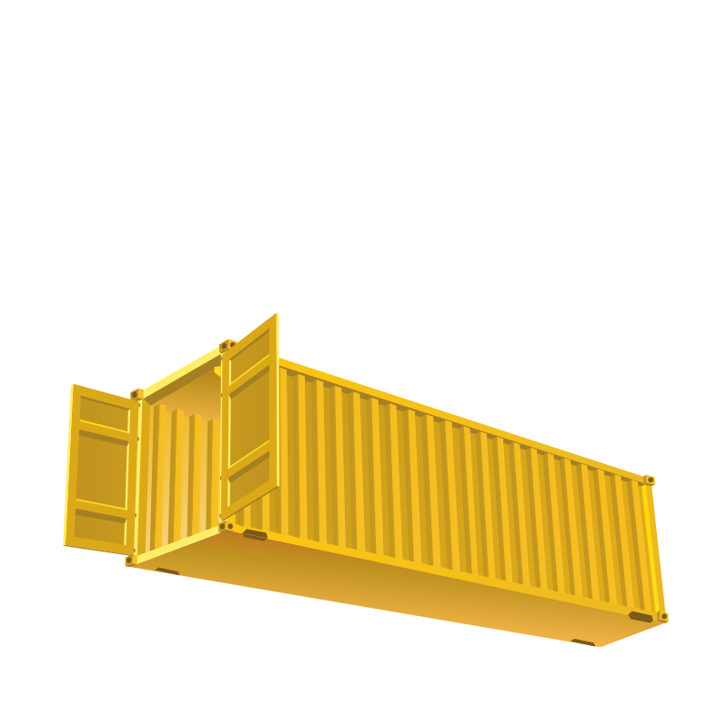

---
## German: Docker Entwickler Spezial Magazin

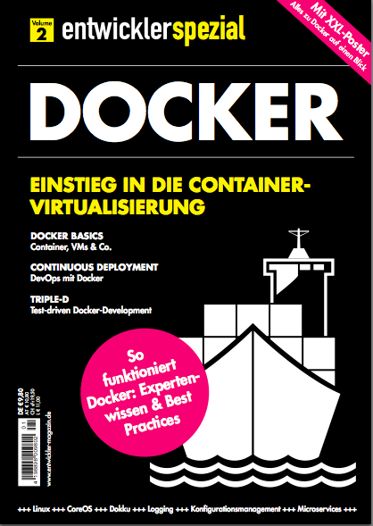
***
  * [Docker Sonderheft](https://entwickler.de/docker_spezial)
  * Update Q1/2017

---
### Docker German Books

* https://www.dpunkt.de/docker
  * Help to translate the book of Adrian Mouat (09/2016)
* https://www.amazon.de/Docker-professionell-einsetzen-Entwickler-Admins/dp/3836239760
  * Tobias Gesellchen and Co:)

---
## bee42 boarding time


Work with the beekeeper!

-
### Send me a message
### <peter.rossbach@bee42.com> @PRossbach


-
### The DevOps-Community needs you !

bee42 solutions gmbh starts the implementation of an **Infrabricks line**!
***
  * Peter Rossbach
    * DevOps and Container-enthusiast
    * Infra-coder with passion
    * System architect
    * Java Developer
    * Apache Tomcat Committer
    * Member of the Apache Software Foundation
    * Founder of the bee42 solutions gmbh
    * CTO of the Setlog GmbH

-
## Links
  - https://blog.hypriot.com/
  - https://github.com/docker/docker
  - https://github.com/docker/machine
  - https://github.com/docker/swarm
  - https://github.com/docker/compose
  - https://github.com/docker/swarmkit
  - https://github.com/docker/infrakit
  - http://de.slideshare.net/Docker/docker-swarm-by-victor-vieux
  - https://medium.com/@Jesse_White/docker-kata-001-1aae05545e3d#.tj2dm7nvu
  - https://kubernetes.io
  - https://lostechies.com/gabrielschenker/2016/09/05/docker-and-swarm-mode-part-1/
