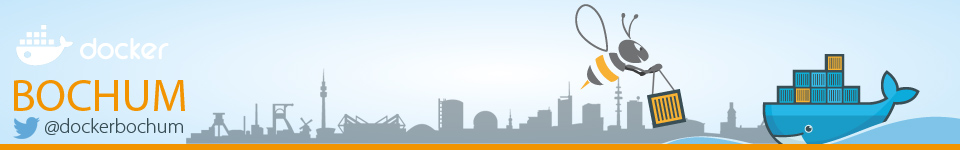
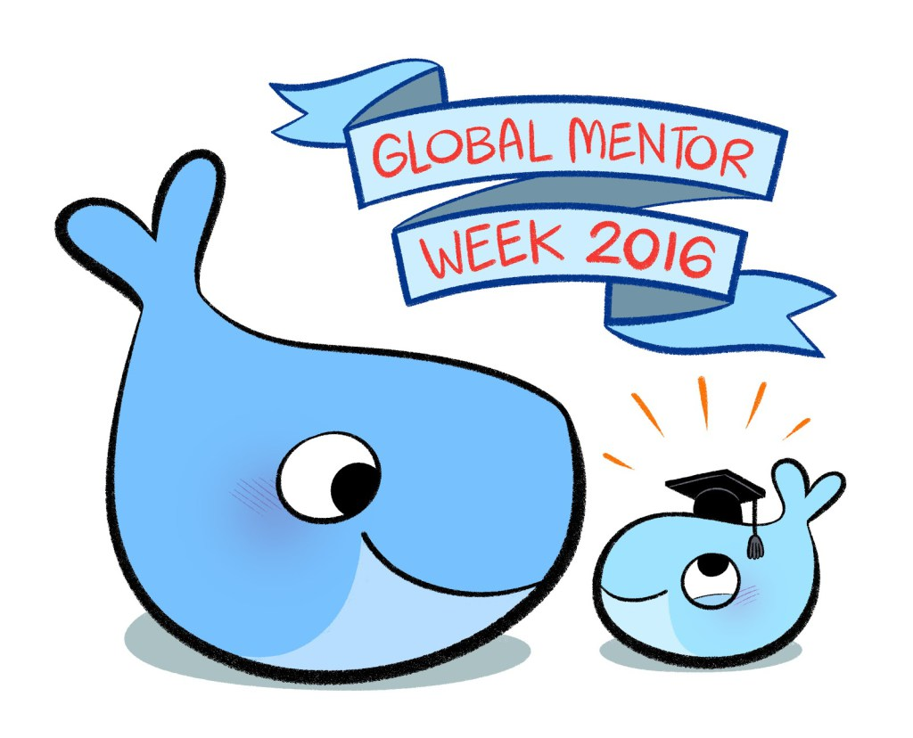

# Meetup Introduction

```
<dieter@hypriot.com> @Quintus23M
Docker Captain && Hypriot Pirate

&&

<peter.rossbach@bee42.com> @PRossbach
bee42 solutions gmbh
```


***
be(e) not perfect...

---
## Sponsor setlog gmbh


***
* https://www.setlog.com/

-
## Sponsor bee42 solutions gmbh


* Docker Training
* Docker Labs und Camps
* Docker Consulting

***
* http://www.bee42.com/

-
## New Docker Bochum Meetup logo



***
* http://www.meetup.com/de-DE/Docker-Bochum/

---
## Docker Agenda

| Time      | Description                                    |
|:----------|:-----------------------------------------------|
| 18:00 Uhr | Einlass                                        |
| 18:20 Uhr | Begrüßung                                      |
| 18:30 Uhr | Mit Docker Software für alle Geräte herstellen |
| 19:15 Uhr | Docker on ARM - Orchestration                  |
| 19:30 Uhr | Docker Hands On Lab                            |
| 21:00 Uhr | Präsentation und Diskussion der Ergebnisse     |
| 22:00 Uhr | Schluss                                        |


---
## Docker Global Mentor Week



***
* https://blog.docker.com/2016/10/docker-global-mentor-week-2016/
* http://www.meetup.com/de-DE/docker-dus/events/234915297/

---
## Start the docker meetup bochum today...


Work with the beekeeper!

-
### Send me a message
### <peter.rossbach@bee42.com> @PRossbach


-
### The DevOps-Community needs you !

bee42 solutions gmbh starts the implementation of an **Infrabricks line**!
***
  * Peter Rossbach
    * DevOps and Container-enthusiast
    * Infra-coder with passion
    * System architect
    * Java Developer
    * Apache Tomcat Committer
    * Member of the Apache Software Foundation
    * Founder of the bee42 solutions gmbh
    * CTO of the Setlog GmbH

-
## Links
  - https://blog.hypriot.com/
  - https://www.docker.com/
